# Задание 1. Генерация списков

## Задача 8

### Текст задачи

Сформировать список из значений true и false по принципу: true — если очередное введенное
число нечетное, false — в противном случае.

### Алгоритм решения

1. Входные данные:

digits (целое число) — количество элементов, которые пользователь планирует ввести.

num (целое число) — вводимое значение на каждой итерации.

2. Выходные данные:

result — итоговый список из true и false.

3. Логика работы:

Начало: Программа запрашивает у пользователя количество чисел для ввода (digits).

Инициализация: Вызывается рекурсивная функция buildList. В качестве начальных параметров передаются:

Значение digits.

Пустой список [].

Рекурсивная проверка (условие выхода):

Если digits равен 0, функция прекращает работу и возвращает список list.

Ввод и обработка:

Если digits больше 0, программа запрашивает ввод целого числа num.

Проверка условия: Вычисляется остаток от деления num на 2.

Если num % 2 = 0 (число четное), создается новый промежуточный список newListTail путем добавления в конец текущего списка значения false (list @ [false]).

Иначе (число нечетное), в newListTail добавляется значение true (list @ [true]).

Рекурсивный шаг: Функция buildList вызывает саму себя.

Счетчик уменьшается на единицу: digits - 1.

Вместо старого списка передается обновленный newListTail.

Завершение: После выполнения всех рекурсивных вызовов итоговый список передается в функцию main.

Вывод: Полученный результат выводится на экран в формате списка.

### Тестирование

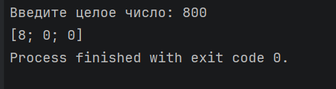

# Задание 2. Рекурсия

## Задача 8

### Текст задачи

Сформировать список из цифр числа.

### Алгоритм решения

1. Входные данные:

num (целое число) — число, введённое пользователем для преобразования в список цифр.

2. Выходные данные:

result (список целых чисел int list) — итоговый список, состоящий из отдельных цифр исходного числа.

3. Логика работы:

Начало: Программа запрашивает у пользователя ввод целого числа (num).

Инициализация: Вызывается рекурсивная функция addDigits. В качестве начальных параметров передаются:

Введённое число num (преобразованное в положительное для корректной обработки знака).

Пустой список [].

Рекурсивная проверка (условие выхода):

Если num равен 0, это означает, что все разряды числа обработаны. Функция прекращает работу и возвращает накопленный список list.

Выделение цифры:

Если num не равен 0, вычисляется последняя цифра числа с помощью операции остатка от деления на 10: let temp = num % 10.

Формирование списка:

Создается новый промежуточный список newList путём добавления текущей цифры temp в начало существующего списка: [temp] @ list.

Рекурсивный шаг: Функция addDigits вызывает саму себя со следующими параметрами:

Число без последней цифры (целочисленное деление на 10): num / 10.

Обновленный список newList.

Завершение: После того как число num станет равным 0, итоговый список передается обратно в функцию main.

Вывод: Полученный результат (result) выводится на экран в формате списка.

### Тестирование

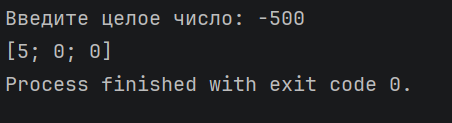
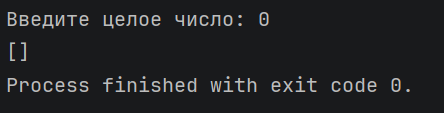

# Задание 3.

## Задача 2

### Текст задачи

Создайте собственные функции для выполнения основных операций над списками (добавление/
удаление/поиск элемента, сцепка двух списков, получение элемента по номеру).

### Алгоритм решения

1. Входные и выходные данные
Входные данные: Команды пользователя (строки), целые числа (значения элементов и индексы).

Выходные данные: Визуальное отображение списка в консоли, сообщения о результатах поиска или ошибках.

2. Структура данных
Используется связанный список целых чисел (int list). Все операции модификации списка реализованы через рекурсию, так как списки в F# являются неизменяемыми (при «изменении» создается новая копия списка).

3. Логика работы функций обработки списка
Каждая функция использует сопоставление с образцом (pattern matching):

Добавление:

addStart: Прямое добавление элемента в голову списка с помощью оператора ::.

addEnd: Рекурсивный проход до пустого хвоста [], куда вставляется элемент [digit].

addIndex: Рекурсивное уменьшение индекса. При достижении 0 элемент вставляется перед текущим головой списка. Если список закончился раньше — элемент добавляется в конец.

Удаление:

removeStart: Возвращает хвост tail, отбрасывая первый элемент.

removeEnd: Рекурсивный проход. Если в списке остался один элемент [_], он заменяется на [].

removeIndex: Рекурсивный поиск. При index = 0 голова head отбрасывается, и возвращается tail.

Поиск и объединение:

getIndex: Рекурсивный счетчик. Если индекс 0, возвращается Some(head). Если индекс не найден — None.

merger: Рекурсивно перебирает первый список до конца, после чего добавляет к нему второй список.

4. Алгоритм работы главного меню (mainMenu)
Это циклическая рекурсивная функция, управляющая состоянием программы:

Отображение: Вывод текущего состояния списка и перечня доступных команд (1–8, exit).

Чтение: Ожидание ввода строки от пользователя.

Обработка выбора (Match):

Команды добавления/удаления: Программа запрашивает дополнительные данные (число или индекс), вызывает соответствующую функцию и перезапускает mainMenu с обновленным списком.

Команда 7 (Поиск): Запрашивает индекс. Выполняет match результата поиска: если Some, выводит число; если None, выводит ошибку. Возврат в меню с текущим списком.

Команда 8 (Объединение): Вызывает merger, объединяя текущий список со статическим списком [10; 20; 30].

Команда exit: Выводит финальное сообщение и завершает рекурсию (выход из программы).

Любой другой ввод: Выводит сообщение об ошибке и перезапускает меню.

5. Точка входа (main)
Программа инициализируется начальным списком [1; 2; 3].

Передает управление в mainMenu, запуская бесконечный цикл обработки до команды выхода.

### Тестирование

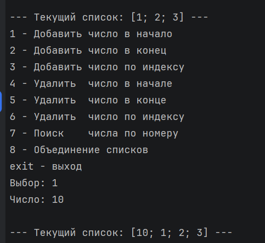
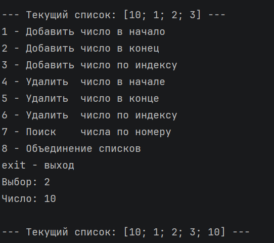
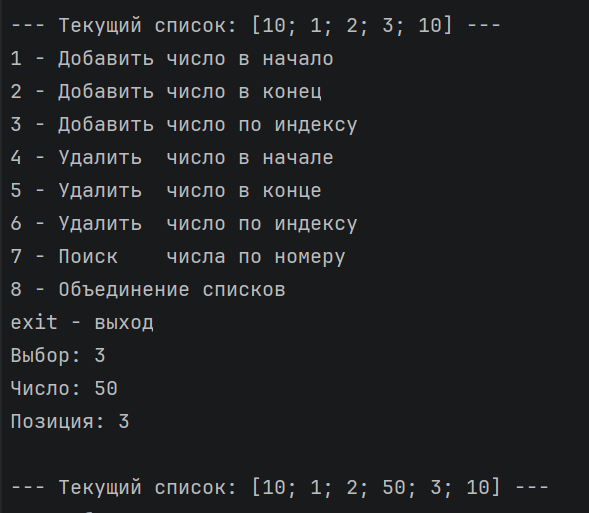
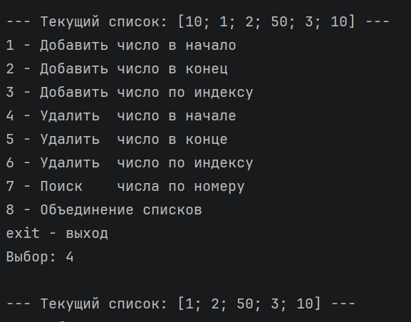
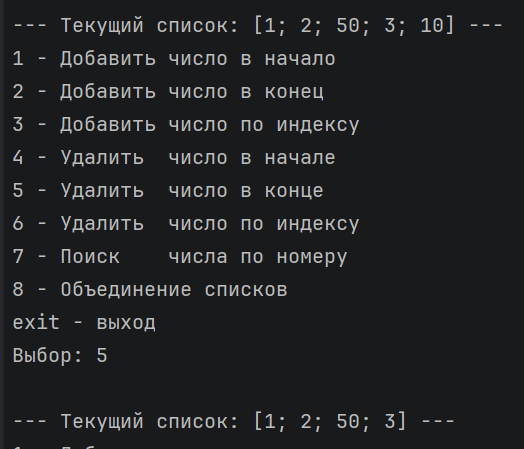
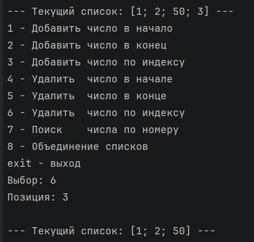
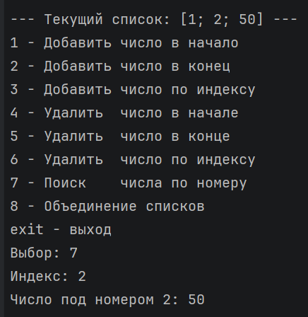
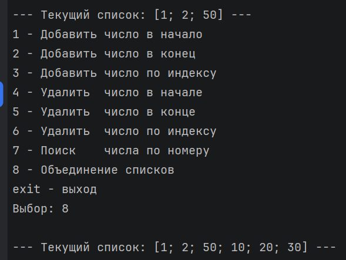
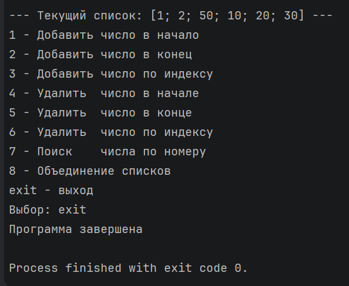